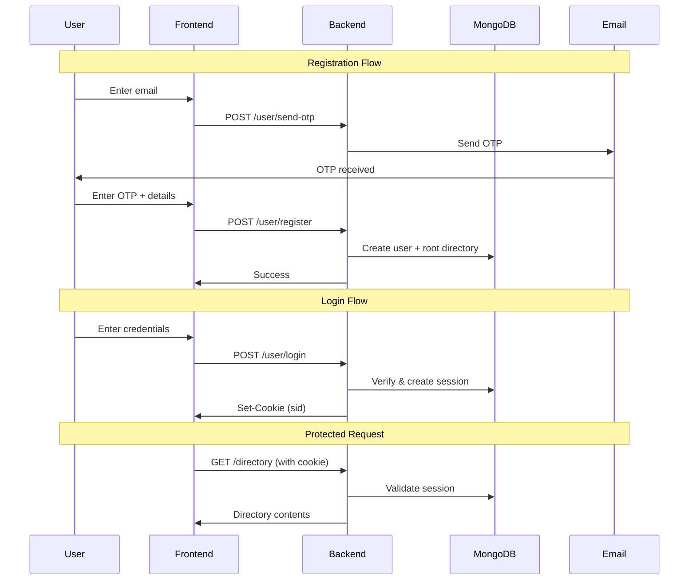

# GoogleDrive Clone - Backend Architecture Documentation

> **Purpose**: This document provides a complete overview of the backend API for building the frontend application. It covers all endpoints, data models, authentication flow, and response formats.

---

## Table of Contents

1. [Project Overview](#project-overview)
2. [Tech Stack](#tech-stack)
3. [Server Configuration](#server-configuration)
4. [Authentication System](#authentication-system)
5. [Data Models](#data-models)
6. [API Endpoints](#api-endpoints)
7. [Error Handling](#error-handling)
8. [Frontend Integration Guidelines](#frontend-integration-guidelines)

---

## Project Overview

This is a **Google Drive Clone** backend that provides:
- User registration with OTP email verification
- Session-based authentication using HTTP-only cookies
- File upload, download, rename, and delete operations
- Directory/folder management with nested structure support
- Per-user isolated storage (each user has their own root directory)

---

## Tech Stack

### Backend

| Technology | Purpose |
|------------|---------|
| **Node.js** | Runtime environment |
| **Express.js** | Web framework |
| **MongoDB** | Database (via Mongoose ODM) |
| **bcrypt** | Password hashing |
| **cookie-parser** | Session cookie handling |
| **Resend** | Email service for OTP |
| **CORS** | Cross-origin resource sharing |

### Frontend (Required)

| Technology | Version | Purpose |
|------------|---------|----------|
| **React** | Latest | UI Library |
| **Vite** | Latest | Build tool & dev server |
| **JavaScript** | ES6+ | Language (**NO TypeScript**) |
| **Tailwind CSS** | v4 | Styling framework |
| **React Router** | v6+ | Client-side routing |

> [!IMPORTANT]
> **DO NOT use TypeScript.** The entire frontend must be built using JavaScript only (.js/.jsx files).

### Frontend Project Setup
```bash
# Create new Vite project with React (JavaScript)
npm create vite@latest frontend -- --template react

cd frontend

# Install Tailwind CSS v4
npm install tailwindcss @tailwindcss/vite

# Install React Router
npm install react-router-dom
```

### Vite Configuration (vite.config.js)
```javascript
import { defineConfig } from 'vite'
import react from '@vitejs/plugin-react'
import tailwindcss from '@tailwindcss/vite'

export default defineConfig({
  plugins: [react(), tailwindcss()],
})
```

### Tailwind CSS Setup (src/index.css)
```css
@import "tailwindcss";
```

---

## Theme System (Light/Dark Mode)

### Implementation Requirements
The frontend **MUST** implement a light/dark theme toggle with the following features:

1. **Theme Toggle Button** - Visible in header/navbar
2. **System Preference Detection** - Detect user's OS theme preference on first load
3. **Theme Persistence** - Save user preference in localStorage
4. **Smooth Transitions** - Animate theme changes

### Theme Context Implementation

Create a `ThemeContext.jsx` for global theme management:

```javascript
// src/context/ThemeContext.jsx
import { createContext, useContext, useState, useEffect } from 'react';

const ThemeContext = createContext();

export function ThemeProvider({ children }) {
  const [theme, setTheme] = useState(() => {
    // Check localStorage first
    const savedTheme = localStorage.getItem('theme');
    if (savedTheme) return savedTheme;
    
    // Check system preference
    if (window.matchMedia('(prefers-color-scheme: dark)').matches) {
      return 'dark';
    }
    return 'light';
  });

  useEffect(() => {
    // Apply theme to document
    const root = document.documentElement;
    if (theme === 'dark') {
      root.classList.add('dark');
    } else {
      root.classList.remove('dark');
    }
    // Persist to localStorage
    localStorage.setItem('theme', theme);
  }, [theme]);

  const toggleTheme = () => {
    setTheme(prev => prev === 'light' ? 'dark' : 'light');
  };

  return (
    <ThemeContext.Provider value={{ theme, toggleTheme }}>
      {children}
    </ThemeContext.Provider>
  );
}

export function useTheme() {
  const context = useContext(ThemeContext);
  if (!context) {
    throw new Error('useTheme must be used within a ThemeProvider');
  }
  return context;
}
```

### Theme Toggle Component

```javascript
// src/components/ThemeToggle.jsx
import { useTheme } from '../context/ThemeContext';

export default function ThemeToggle() {
  const { theme, toggleTheme } = useTheme();

  return (
    <button
      onClick={toggleTheme}
      className="p-2 rounded-lg bg-gray-200 dark:bg-gray-700 
                 hover:bg-gray-300 dark:hover:bg-gray-600 
                 transition-colors duration-200"
      aria-label="Toggle theme"
    >
      {theme === 'light' ? (
        // Moon icon for dark mode
        <svg className="w-5 h-5" fill="currentColor" viewBox="0 0 20 20">
          <path d="M17.293 13.293A8 8 0 016.707 2.707a8.001 8.001 0 1010.586 10.586z" />
        </svg>
      ) : (
        // Sun icon for light mode
        <svg className="w-5 h-5" fill="currentColor" viewBox="0 0 20 20">
          <path fillRule="evenodd" d="M10 2a1 1 0 011 1v1a1 1 0 11-2 0V3a1 1 0 011-1zm4 8a4 4 0 11-8 0 4 4 0 018 0zm-.464 4.95l.707.707a1 1 0 001.414-1.414l-.707-.707a1 1 0 00-1.414 1.414zm2.12-10.607a1 1 0 010 1.414l-.706.707a1 1 0 11-1.414-1.414l.707-.707a1 1 0 011.414 0zM17 11a1 1 0 100-2h-1a1 1 0 100 2h1zm-7 4a1 1 0 011 1v1a1 1 0 11-2 0v-1a1 1 0 011-1zM5.05 6.464A1 1 0 106.465 5.05l-.708-.707a1 1 0 00-1.414 1.414l.707.707zm1.414 8.486l-.707.707a1 1 0 01-1.414-1.414l.707-.707a1 1 0 011.414 1.414zM4 11a1 1 0 100-2H3a1 1 0 000 2h1z" clipRule="evenodd" />
        </svg>
      )}
    </button>
  );
}
```

### Color Palette (Tailwind CSS v4)

Define a consistent color scheme for both themes:

```css
/* src/index.css */
@import "tailwindcss";

@theme {
  /* Light mode colors (default) */
  --color-background: #ffffff;
  --color-surface: #f8fafc;
  --color-surface-hover: #f1f5f9;
  --color-border: #e2e8f0;
  --color-text-primary: #0f172a;
  --color-text-secondary: #475569;
  --color-text-muted: #94a3b8;
  
  /* Brand colors */
  --color-primary: #3b82f6;
  --color-primary-hover: #2563eb;
  --color-primary-light: #dbeafe;
  
  /* Status colors */
  --color-success: #22c55e;
  --color-warning: #f59e0b;
  --color-error: #ef4444;
}

/* Dark mode overrides */
.dark {
  --color-background: #0f172a;
  --color-surface: #1e293b;
  --color-surface-hover: #334155;
  --color-border: #334155;
  --color-text-primary: #f8fafc;
  --color-text-secondary: #cbd5e1;
  --color-text-muted: #64748b;
  
  --color-primary: #60a5fa;
  --color-primary-hover: #3b82f6;
  --color-primary-light: #1e3a5f;
}

/* Smooth theme transitions */
* {
  transition: background-color 0.2s ease, border-color 0.2s ease, color 0.2s ease;
}
```

### Usage in Components

```javascript
// Example: File card with theme support
function FileCard({ file }) {
  return (
    <div className="bg-surface hover:bg-surface-hover border border-border 
                    rounded-lg p-4 cursor-pointer transition-all
                    text-text-primary">
      <div className="flex items-center gap-3">
        <FileIcon extension={file.extension} />
        <div>
          <p className="font-medium">{file.name}</p>
          <p className="text-sm text-text-secondary">{file.extension}</p>
        </div>
      </div>
    </div>
  );
}
```

### App Entry Point

```javascript
// src/main.jsx
import { StrictMode } from 'react'
import { createRoot } from 'react-dom/client'
import { BrowserRouter } from 'react-router-dom'
import { ThemeProvider } from './context/ThemeContext'
import App from './App.jsx'
import './index.css'

createRoot(document.getElementById('root')).render(
  <StrictMode>
    <BrowserRouter>
      <ThemeProvider>
        <App />
      </ThemeProvider>
    </BrowserRouter>
  </StrictMode>,
)
```

---

## Server Configuration

| Setting | Value |
|---------|-------|
| **Base URL** | `http://localhost:4000` |
| **Frontend Origin** | `http://localhost:5173` |
| **Credentials** | Enabled (`credentials: true`) |
| **Cookie Secret** | `RudraSecret` |

### CORS Setup
```javascript
cors({
    origin: 'http://localhost:5173',
    credentials: true
})
```

> [!IMPORTANT]
> All API requests from frontend must include `credentials: 'include'` to send cookies.

---

## Authentication System

### Overview
- Uses **session-based authentication** with signed HTTP-only cookies
- Session stored in MongoDB with 1-hour expiry (auto-deleted via TTL index)
- Cookie named `sid` stores the session ID
- Maximum **2 concurrent sessions** allowed per user

### Authentication Flow



### Cookie Details
| Property | Value |
|----------|-------|
| Name | `sid` |
| HttpOnly | `true` |
| Signed | `true` |
| Max Age | 7 days (`604800000` ms) |

---

## Data Models

### User
```javascript
{
    _id: ObjectId,           // MongoDB ID
    name: String,            // Min 3 characters
    email: String,           // Unique, valid email format
    password: String,        // Hashed with bcrypt (12 rounds)
    rootDirId: ObjectId      // Reference to user's root directory
}
```

### Directory
```javascript
{
    _id: ObjectId,           // MongoDB ID
    name: String,            // Directory name
    userId: ObjectId,        // Owner user ID
    parentDirId: ObjectId | null  // null for root directory
}
```

### File
```javascript
{
    _id: ObjectId,           // MongoDB ID
    name: String,            // File name with extension
    extension: String,       // File extension (e.g., ".pdf", ".jpg")
    parentDirId: ObjectId,   // Parent directory ID
    userId: ObjectId         // Owner user ID
}
```

### Session
```javascript
{
    _id: ObjectId,           // Session ID (stored in cookie)
    userId: ObjectId,        // User reference
    createdAt: Date          // Auto-expires after 1 hour
}
```

### OTP
```javascript
{
    _id: ObjectId,
    email: String,           // Email address
    otp: Number,             // 4-digit OTP code
    createdAt: Date          // Auto-expires after 5 minutes
}
```

---

## API Endpoints

### User Routes (`/user`)

#### 1. Send OTP
Request OTP for email verification before registration.

| Method | Endpoint | Auth Required |
|--------|----------|---------------|
| POST | `/user/send-otp` | ❌ No |

**Request Body:**
```json
{
    "email": "user@example.com"
}
```

**Response (201):**
```json
{
    "success": true,
    "message": "OTP sent successfully on user@example.com"
}
```

---

#### 2. Register User
Create a new user account after OTP verification.

| Method | Endpoint | Auth Required |
|--------|----------|---------------|
| POST | `/user/register` | ❌ No |

**Request Body:**
```json
{
    "name": "John Doe",
    "email": "user@example.com",
    "password": "password123",
    "otp": "1234"
}
```

**Response (201):**
```json
{
    "message": "User registered successfully"
}
```

**Errors:**
| Status | Message |
|--------|---------|
| 400 | `Invalid OTP..` |
| 400 | `User with this email already exists` |
| 400 | Validation errors (name length, email format) |

---

#### 3. Login
Authenticate user and create session.

| Method | Endpoint | Auth Required |
|--------|----------|---------------|
| POST | `/user/login` | ❌ No |

**Request Body:**
```json
{
    "email": "user@example.com",
    "password": "password123"
}
```

**Response (200):**
```json
{
    "message": "Login successful"
}
```

**Response Headers:** Sets `sid` cookie

**Errors:**
| Status | Message |
|--------|---------|
| 401 | `not registered!!` |
| 401 | `Invalid email or password !` |

---

#### 4. Get User Profile
Retrieve current authenticated user's profile.

| Method | Endpoint | Auth Required |
|--------|----------|---------------|
| GET | `/user/` | ✅ Yes |

**Response (200):**
```json
{
    "name": "John Doe",
    "email": "user@example.com"
}
```

---

#### 5. Logout
End current session.

| Method | Endpoint | Auth Required |
|--------|----------|---------------|
| POST | `/user/logout` | ❌ No (but deletes session) |

**Response (204):** No content

---

#### 6. Logout All Devices
End all sessions for the user.

| Method | Endpoint | Auth Required |
|--------|----------|---------------|
| POST | `/user/logoutall` | ✅ Yes |

**Response (204):** No content

---

### Directory Routes (`/directory`)

> [!NOTE]
> All directory routes require authentication.

#### 1. Get Directory Contents
Retrieve contents of a directory (files and subdirectories).

| Method | Endpoint | Auth Required |
|--------|----------|---------------|
| GET | `/directory/` | ✅ Yes |
| GET | `/directory/:id` | ✅ Yes |

**Parameters:**
- `:id` (optional) - Directory ID. If omitted, returns root directory.

**Response (200):**
```json
{
    "_id": "64abc123...",
    "name": "root -user@example.com",
    "userId": "64xyz789...",
    "parentDirId": null,
    "files": [
        {
            "id": "64file123...",
            "_id": "64file123...",
            "name": "document.pdf",
            "extension": ".pdf",
            "parentDirId": "64abc123...",
            "userId": "64xyz789..."
        }
    ],
    "directories": [
        {
            "id": "64dir456...",
            "_id": "64dir456...",
            "name": "My Folder",
            "userId": "64xyz789...",
            "parentDirId": "64abc123..."
        }
    ]
}
```

**Errors:**
| Status | Message |
|--------|---------|
| 404 | `Directory not found or you do not have access to it!` |

---

#### 2. Create Directory
Create a new directory/folder.

| Method | Endpoint | Auth Required |
|--------|----------|---------------|
| POST | `/directory/` | ✅ Yes |
| POST | `/directory/:parentId` | ✅ Yes |

**Parameters:**
- `:parentId` (optional) - Parent directory ID. If omitted, creates in root.

**Headers:**
| Header | Required | Description |
|--------|----------|-------------|
| `dirname` | Optional | Directory name (default: "new folder") |

**Response (201):**
```json
{
    "message": "Directory created"
}
```

---

#### 3. Rename Directory
Change the name of a directory.

| Method | Endpoint | Auth Required |
|--------|----------|---------------|
| PATCH | `/directory/:id` | ✅ Yes |

**Request Body:**
```json
{
    "newDirName": "New Folder Name"
}
```

**Response (200):**
```json
{
    "message": "Directory renamed"
}
```

---

#### 4. Delete Directory
Delete a directory and ALL its contents (recursive).

| Method | Endpoint | Auth Required |
|--------|----------|---------------|
| DELETE | `/directory/:id` | ✅ Yes |

**Response (200):**
```json
{
    "message": "Directory and all its contents deleted"
}
```

**Errors:**
| Status | Message |
|--------|---------|
| 404 | `dir is not found or you are not authorise` |

> [!CAUTION]
> This operation is **irreversible**. All files and subdirectories will be permanently deleted.

---

### File Routes (`/file`)

> [!NOTE]
> All file routes require authentication.

#### 1. Get/Download File
Retrieve or download a file.

| Method | Endpoint | Auth Required |
|--------|----------|---------------|
| GET | `/file/:id` | ✅ Yes |
| GET | `/file/:id?action=download` | ✅ Yes |

**Parameters:**
- `:id` - File ID

**Query Parameters:**
| Param | Description |
|-------|-------------|
| `action=download` | Force download with original filename |

**Response:**
- Without `action`: Streams the file (for viewing/preview)
- With `action=download`: Downloads file with `Content-Disposition` header

**Errors:**
| Status | Message |
|--------|---------|
| 404 | `File not found and or you do not have access to it!` |

---

#### 2. Upload File
Upload a new file using streaming.

| Method | Endpoint | Auth Required |
|--------|----------|---------------|
| POST | `/file/` | ✅ Yes |
| POST | `/file/:parentDirId` | ✅ Yes |

**Parameters:**
- `:parentDirId` (optional) - Target directory ID. If omitted, uploads to root.

**Headers:**
| Header | Required | Description |
|--------|----------|-------------|
| `filename` | Optional | File name (default: "untitled") |
| `Content-Type` | Required | MIME type of the file |

**Request Body:** Raw file binary data (streaming upload)

**Example (JavaScript fetch):**
```javascript
const file = document.querySelector('input[type="file"]').files[0];

await fetch('http://localhost:4000/file/', {
    method: 'POST',
    headers: {
        'filename': file.name,
        'Content-Type': file.type
    },
    body: file,  // Raw file, NOT FormData
    credentials: 'include'
});
```

**Response (201):**
```json
{
    "message": "File uploaded successfully"
}
```

**Errors:**
| Status | Message |
|--------|---------|
| 404 | `Parent directory not found!` |

---

#### 3. Rename File
Change the name of a file.

| Method | Endpoint | Auth Required |
|--------|----------|---------------|
| PATCH | `/file/:id` | ✅ Yes |

**Request Body:**
```json
{
    "newFileName": "new-name.pdf"
}
```

**Response (200):**
```json
{
    "message": "File renamed",
    "newName": "new-name.pdf"
}
```

**Errors:**
| Status | Message |
|--------|---------|
| 404 | `File not found or you do not have access to it!` |

---

#### 4. Delete File
Permanently delete a file.

| Method | Endpoint | Auth Required |
|--------|----------|---------------|
| DELETE | `/file/:id` | ✅ Yes |

**Response (200):**
```json
{
    "message": "File deleted successfully"
}
```

**Errors:**
| Status | Message |
|--------|---------|
| 404 | `File not found! or you do not have access to it!` |

---

## Error Handling

### Global Error Response Format
```json
{
    "error": "Error message here"
}
```

### Common Error Codes

| Status | Meaning |
|--------|---------|
| 400 | Bad Request (validation errors, invalid format) |
| 401 | Unauthorized (not logged in) |
| 404 | Not Found (resource doesn't exist or no access) |
| 500 | Internal Server Error |

### Authentication Error
When not logged in or session expired:
```json
{
    "error": "Not logged!"
}
```

### Invalid ID Format
When passing invalid MongoDB ObjectId:
```json
{
    "error": "Invalid file ID format"
}
```

---

## Frontend Integration Guidelines

### 1. API Client Setup
```javascript
const API_BASE = 'http://localhost:4000';

async function apiRequest(endpoint, options = {}) {
    const response = await fetch(`${API_BASE}${endpoint}`, {
        ...options,
        credentials: 'include',  // REQUIRED for cookies
        headers: {
            'Content-Type': 'application/json',
            ...options.headers
        }
    });
    
    if (!response.ok) {
        const error = await response.json();
        throw new Error(error.error);
    }
    
    // Handle 204 No Content
    if (response.status === 204) return null;
    
    return response.json();
}
```

### 2. Authentication State
Check if user is logged in by calling `/user/`:
```javascript
async function checkAuth() {
    try {
        const user = await apiRequest('/user/');
        return { isLoggedIn: true, user };
    } catch (error) {
        return { isLoggedIn: false, user: null };
    }
}
```

### 3. File Upload Implementation
```javascript
async function uploadFile(file, parentDirId = null) {
    const endpoint = parentDirId ? `/file/${parentDirId}` : '/file/';
    
    const response = await fetch(`${API_BASE}${endpoint}`, {
        method: 'POST',
        headers: {
            'filename': file.name
        },
        body: file,  // Raw file, streaming upload
        credentials: 'include'
    });
    
    return response.json();
}
```

### 4. File Preview/Download
```javascript
// Preview (images, PDFs, etc.)
function getFilePreviewUrl(fileId) {
    return `${API_BASE}/file/${fileId}`;
}

// Download
function getFileDownloadUrl(fileId) {
    return `${API_BASE}/file/${fileId}?action=download`;
}
```

### 5. Navigation Structure
```javascript
// Breadcrumb navigation - track parent directories
// When navigating to a subdirectory, store parent info

async function navigateToDirectory(dirId = null) {
    const endpoint = dirId ? `/directory/${dirId}` : '/directory/';
    const data = await apiRequest(endpoint);
    
    return {
        currentDir: {
            id: data._id,
            name: data.name,
            parentId: data.parentDirId
        },
        contents: {
            files: data.files,
            directories: data.directories
        }
    };
}
```

### 6. Suggested Frontend Features

| Feature | Description |
|---------|-------------|
| **Landing Page** | Login/Register forms with OTP verification |
| **Dashboard** | File manager interface with directory tree |
| **File Preview** | Modal/page for viewing files (images, PDFs, videos) |
| **Upload Modal** | Drag-and-drop or file picker for uploads |
| **Context Menu** | Right-click menu for rename/delete operations |
| **Breadcrumb** | Navigation path showing current directory location |
| **Search** | (Future) Search files by name |
| **Grid/List View** | Toggle between different file display modes |

### 7. Recommended UI Components

```
├── Auth Pages
│   ├── LoginPage
│   ├── RegisterPage (with OTP step)
│   └── ForgotPassword (if implemented)
│
├── Main App
│   ├── Sidebar
│   │   └── FolderTree
│   ├── Header
│   │   ├── SearchBar
│   │   ├── ViewToggle
│   │   └── UserMenu
│   ├── Breadcrumb
│   ├── FileGrid / FileList
│   │   ├── FolderCard
│   │   └── FileCard
│   └── Modals
│       ├── UploadModal
│       ├── NewFolderModal
│       ├── RenameModal
│       └── DeleteConfirmModal
│
└── FilePreview Page/Modal
    ├── ImageViewer
    ├── PDFViewer
    ├── VideoPlayer
    └── DownloadFallback
```

---

## Environment Variables

| Variable | Description |
|----------|-------------|
| `RESEND_API_KEY` | API key for Resend email service |
| `MONGODB_URI` | MongoDB connection string (currently hardcoded) |

---

## Quick Reference

### All Endpoints Summary

| Method | Endpoint | Description | Auth |
|--------|----------|-------------|------|
| POST | `/user/send-otp` | Request OTP | ❌ |
| POST | `/user/register` | Create account | ❌ |
| POST | `/user/login` | Login | ❌ |
| GET | `/user/` | Get profile | ✅ |
| POST | `/user/logout` | Logout | ❌ |
| POST | `/user/logoutall` | Logout all devices | ✅ |
| GET | `/directory/` | Get root directory | ✅ |
| GET | `/directory/:id` | Get directory by ID | ✅ |
| POST | `/directory/` | Create folder in root | ✅ |
| POST | `/directory/:parentId` | Create folder | ✅ |
| PATCH | `/directory/:id` | Rename directory | ✅ |
| DELETE | `/directory/:id` | Delete directory | ✅ |
| GET | `/file/:id` | View/Download file | ✅ |
| POST | `/file/` | Upload to root | ✅ |
| POST | `/file/:parentDirId` | Upload to folder | ✅ |
| PATCH | `/file/:id` | Rename file | ✅ |
| DELETE | `/file/:id` | Delete file | ✅ |

---

**Last Updated:** January 2026
